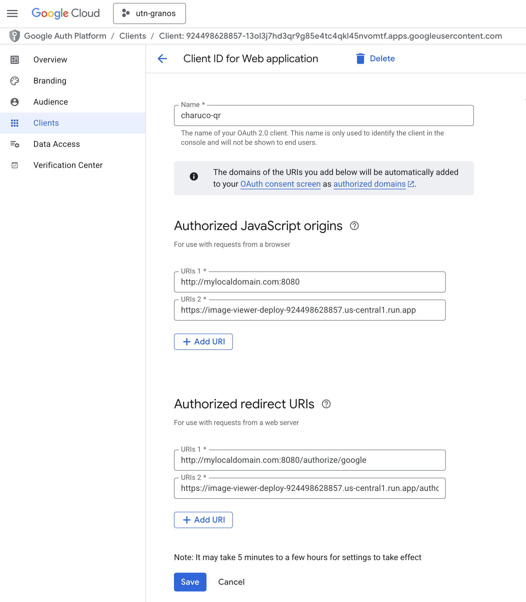

# Grain-QD-Detection

A web application for detecting ChArUco patterns and QR codes in images, with support for local files (located on the user's computer), server-side files (located on the server), and Google Drive integration.


## Table of Contents

- [Grain-QD-Detection](#grain-qd-detection)
  - [Table of Contents](#table-of-contents)
  - [Overview](#overview)
  - [Key Features](#key-features)
  - [How It Works](#how-it-works)
  - [Technical Stack](#technical-stack)
  - [Project Structure](#project-structure)
  - [Getting Started](#getting-started)
    - [Prerequisites](#prerequisites)
    - [Configuration](#configuration)
      - [Method 1: Local Development (`client_secret.json`)](#method-1-local-development-client_secretjson)
      - [Method 2: Cloud Deployment (Environment Variable)](#method-2-cloud-deployment-environment-variable)
    - [Local Development](#local-development)
    - [Google Cloud Deployment](#google-cloud-deployment)

## Overview

This project is a web application designed for the detection and analysis of quality control markers in images, specifically focusing on ChArUco patterns and QR codes. It provides a user-friendly interface to process images either from a local source or directly from a user's Google Drive, making it a versatile tool for image-based quality inspection and data extraction.

The application analyzes images to identify these markers, overlays visual feedback onto the processed image, and extracts valuable data, such as the content of QR codes.

## Key Features

*   **Dual Marker Detection:** Capable of identifying both ChArUco board patterns and QR codes within the same image.
*   **Rich Data Extraction:** Decodes QR code data, including validation and parsing of JSON-formatted content, and reports the status of ChArUco detection.
*   **Visual Feedback:** Overlays colored polygons on the detected markers for clear visual confirmation and displays extracted information in a dedicated panel.
*   **Flexible Image Sourcing:** Supports processing images uploaded from a local computer or fetching them from a specified Google Drive folder.
*   **Web-Based UI:** A clean and interactive web interface built with the Flask framework, allowing for easy image loading, navigation, and data visualization.
*   **Google Integration:** Securely authenticates with Google via OAuth 2.0 to access user-specified image folders in Google Drive.
*   **Containerized Deployment:** Fully containerized using Docker and includes scripts to facilitate deployment to Google Cloud Platform (GCP), specifically Cloud Run.

## How It Works

The application provides two main workflows for image processing:

1.  **Local File Processing:** A user can upload one or more images from their computer. The application processes the first image and displays the original, the processed version with markers highlighted, and an information panel. Navigation buttons allow the user to cycle through the entire batch of uploaded images.

2.  **Google Drive Processing:** A user can log in with their Google account and provide a link to a folder in their Google Drive. The application then fetches the images from this folder and processes them sequentially, offering the same navigation and analysis experience as the local processing flow.

## Technical Stack

*   **Backend:** **Flask** web framework.
*   **WSGI Server:** **Gunicorn** for production environments.
*   **Image Processing:** **OpenCV** for ChArUco and QR code detection.
*   **Containerization:** **Docker**.
*   **Deployment:** **Google Cloud Run**.

## Project Structure

The project follows a standard Flask application layout:

```
.
├── app.py                  # Main Flask application logic and routes
├── image_processor.py      # Core image analysis functions
├── templates/              # HTML templates for the UI
│   └── index.html
├── static/                 # CSS, JavaScript, and other static assets
├── Dockerfile              # Defines the container for deployment
├── client_secret.json      # Google OAuth credentials (for local use)
├── scripts/
│   ├── build_and_run_locally.sh
│   └── upload_to_gcp.sh
└── README.md
```

## Getting Started

### Prerequisites

*   Docker installed on your local machine.
*   A Google Cloud Platform project with the **Secret Manager** and **Cloud Run** APIs enabled.
*   The Google Cloud SDK (`gcloud`) installed and configured for your GCP project.

### Configuration

The application requires Google OAuth 2.0 credentials to access Google Drive.

1.  In the Google Cloud Console, navigate to **APIs & Services > Credentials**.
2.  Click **Create Credentials** and select **OAuth client ID**.
3.  Choose **Web application** as the application type.
4.  Add the necessary **Authorized redirect URIs**:
    *   For local development: `http://mylocaldomain.com:8080/oauth2callback`
    *   For deployed app: `https://<your-cloud-run-url>/oauth2callback`
5.  Create the client ID. You will be presented with a Client ID and a Client Secret.

**IMPORTANT:** For Google Authentication to workmylocaldomain.com must be defined in /etc/hosts pointing to localhost.
and mylocaldomain.com declared in Google Auth platform (see below).



#### Method 1: Local Development (`client_secret.json`)

Download the credentials JSON file from the Google Cloud Console and save it as `client_secret.json` in the project's root directory. This method is suitable for local testing only.

#### Method 2: Cloud Deployment (Environment Variable)

For production environments like Cloud Run, it is highly recommended to use GCP Secret Manager for security.

1.  Store the entire content of the `client_secret.json` file as a new secret in **GCP Secret Manager**.
2.  Set the following environment variable in your Cloud Run service, pointing to the secret you just created:
    *   `GOOGLE_CREDENTIALS_SECRET_PATH`: The full resource name of the secret.
        *   Example: `projects/your-gcp-project-id/secrets/your-secret-name/versions/latest`

The deployment script in `scripts/upload_to_gcp.sh` is designed to help set this environment variable.

### Local Development

The included script builds the Docker image and runs it in a local container.

```bash
# From the project root directory
sh ./scripts/build_and_run_locally.sh
```

You can then access the application at `http://mylocaldomain.com:8080`.

### Google Cloud Deployment

A deployment script automates the process of building the Docker image, pushing it to Google Artifact Registry, and deploying it as a new service on Cloud Run.

```bash
# Make sure to edit the script with your GCP project details first
sh ./scripts/upload_to_gcp.sh
```

This script ensures that the correct environment variables (like the one for Google credentials) are set for the Cloud Run service during deployment.