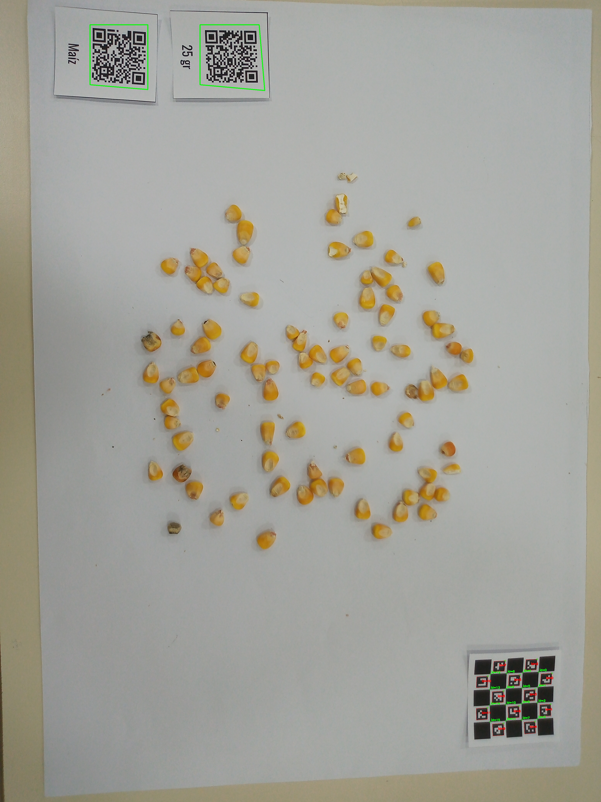

# Grain-QD-Detection & Web Viewer

## Project Overview

This project is a Flask web application designed for viewing, processing, and analyzing images containing QR codes and ChArUco calibration boards. It allows users to upload images locally or connect to their Google Drive to select and process images directly from the cloud. The application provides an interactive interface to view original and processed images side-by-side, with features for zoom/pan, and detailed information display for detected elements.

## Features

*   **Local Image Upload:** Upload images directly from your computer for processing.
*   **QR Code Detection & Decoding:** Identifies QR codes in images and extracts their data.
*   **ChArUco Board Detection:** Detects ChArUco boards, useful for camera calibration and spatial localization tasks.
*   **Interactive Image Viewer:**
    *   Displays original and processed (annotated) images.
    *   Supports zoom via mouse wheel and panning via drag-and-drop.
    *   Dedicated controls for zoom in, zoom out, and reset zoom.
*   **Google Drive Integration:**
    *   Secure login with Google OAuth 2.0.
    *   List folders from your Google Drive.
    *   Select a folder to view and process images directly from it.
    *   Seamlessly switch between local and Drive image sources.
*   **Information Panel:** Shows real-time status of ChArUco detection and lists decoded QR code data.
*   **Batch Processing Capabilities:** (Underlying scripts, `read_qr.py`, `detect_and_draw_qr.py`, `batch_process_qrs.py` can be used for command-line batch operations).

## Tech Stack

*   **Backend:** Python, Flask
*   **Frontend:** HTML, CSS, JavaScript, Bootstrap 5
*   **Image Processing:** OpenCV (`opencv-python-headless`), Pillow
*   **Google API Client:** `google-api-python-client`, `google-auth-httplib2`, `google-auth-oauthlib`
*   **QR Decoding:** `qreader`
*   **Testing:** `unittest` (Python standard library)

## Screenshots

*Main application interface showing an image with detected QR codes and ChArUco board:*


*Google Drive folder selection modal:*


*(Existing QR detection example images can be kept or updated)*
<div style="display: flex; gap: 10px;">
   
   
</div>

## Setup and Installation

### Prerequisites
*   Python 3.8 or newer
*   `pip` (Python package installer)

### Installation Steps

1.  **Clone the repository:**
    ```bash
    git clone https://github.com/your-username/Grain-QD-Detection.git
    # Replace with your actual repository URL if forked/different
    cd Grain-QD-Detection
    ```

2.  **Create and activate a virtual environment (recommended):**
    ```bash
    python -m venv venv
    # On Windows
    venv\Scripts\activate
    # On macOS/Linux
    source venv/bin/activate
    ```

3.  **Install dependencies:**
    ```bash
    pip install -r requirements.txt
    ```

4.  **Google OAuth Setup (for Google Drive Integration):**
    *   Go to the [Google Cloud Console](https://console.cloud.google.com/).
    *   Create a new project or select an existing one.
    *   In the navigation menu, go to "APIs & Services" > "Enabled APIs & services". Click "+ ENABLE APIS AND SERVICES" and search for "Google Drive API". Enable it.
    *   Go to "APIs & Services" > "Credentials".
    *   Click "+ CREATE CREDENTIALS" and choose "OAuth client ID".
    *   If prompted, configure the OAuth consent screen:
        *   User Type: External (or Internal if applicable to your GSuite organization).
        *   App name: (e.g., "Grain QD Detector WebApp")
        *   User support email: Your email.
        *   Developer contact information: Your email.
        *   Scopes: Add `/auth/drive.metadata.readonly` and `/auth/drive.readonly`.
        *   Test users: Add your Google account email(s) while the app is in "Testing" publish status.
    *   Select "Web application" as the application type.
    *   **Authorized JavaScript origins:** Add your application's origins. For local development, these are typically:
        *   `http://localhost:8000`
        *   `http://127.0.0.1:8000`
    *   **Authorized redirect URIs:** Add the URI for the OAuth callback. For this application, it is:
        *   `http://localhost:8000/authorize/google`
        *   `http://127.0.0.1:8000/authorize/google`
    *   Click "CREATE".
    *   Download the client secret JSON file. Rename it to `client_secret.json` and place it in the root directory of this project.
    *   **IMPORTANT:** This `client_secret.json` file contains sensitive information. **Do not commit it to version control.** Ensure it is listed in your `.gitignore` file (a line with `client_secret.json` should be added if not present).

5.  **Set Flask Secret Key:**
    The application requires a secret key for session management. Set it as an environment variable:
    ```bash
    # On macOS/Linux
    export FLASK_SECRET_KEY='your_very_secret_random_key_here'
    # On Windows (cmd)
    set FLASK_SECRET_KEY='your_very_secret_random_key_here'
    # On Windows (PowerShell)
    $env:FLASK_SECRET_KEY='your_very_secret_random_key_here'
    ```
    Replace `'your_very_secret_random_key_here'` with a strong, unique key.

## Running the Application

1.  Ensure your virtual environment is activated and all dependencies are installed.
2.  Set the `FLASK_SECRET_KEY` environment variable as described above.
3.  Run the Flask development server:
    ```bash
    python app.py
    ```
4.  Open your web browser and navigate to `http://127.0.0.1:8000/`.

## Usage

### Local Files
1.  Click the "Select Images" button on the main page.
2.  Choose one or more image files from your computer. Accepted formats: PNG, JPG/JPEG, BMP, GIF.
3.  The images will be uploaded, and the first selected image will be processed and displayed.
4.  Use the "Previous" and "Next" buttons below the original image display to navigate through your uploaded batch.

### Google Drive Integration
1.  Click the "Login with Google" button. You will be redirected to Google for authentication.
2.  Sign in with your Google account and grant the requested permissions (view metadata and files in your Google Drive).
3.  Once logged in, click the "List Google Drive Folders" button.
4.  A page will display a list of folders from your Google Drive. Click on a folder name to select it.
5.  After selecting a folder, the application will list images found in that folder. The first image will be loaded and processed.
6.  Navigate through Drive images using the "Previous" and "Next" buttons.
7.  To switch back to local file mode, simply use the "Select Images" button to upload local files. This will clear the Drive session.
8.  To disconnect from Google Drive, click the "Logout from Google" button.

### Image Viewer
*   **Left Panel:** Displays the original uploaded/selected image.
*   **Center Panel (Processed Image):**
    *   Shows the image after QR code and ChArUco board detection (annotations are drawn).
    *   **Zoom:** Use the mouse wheel while hovering over this image to zoom in or out.
    *   **Pan:** Click and drag the processed image to pan.
    *   **Controls:** Use the "Reset Zoom", "Zoom In (+)", and "Zoom Out (-)" buttons below the processed image for additional control.
*   **Right Panel (Information):**
    *   **ChArUco Status:** Indicates if a ChArUco board was detected ("Detected", "Not Detected", or "Unknown").
    *   **QR Decoded Data:** Lists all detected QR codes and their decoded data. If the data is JSON, it will be pretty-printed.

## Project Structure

```
Grain-QD-Detection/
├── app.py                    # Main Flask application file
├── test_app.py               # Unit and integration tests
├── requirements.txt          # Python dependencies
├── client_secret.json        # (Gitignored) Google OAuth client secrets
├── static/                   # Frontend static files
│   ├── app.js                # Main JavaScript for frontend interactions
│   └── style.css             # Custom CSS styles
├── templates/                # HTML templates for Flask
│   ├── index.html            # Main application page
│   ├── drive_folders.html    # Page for listing Google Drive folders
│   └── error.html            # Generic error display page
├── uploads/                  # Default temporary storage for local image uploads
├── drive_temp_downloads/     # Default temporary storage for Drive image downloads
├── readme_img/               # Images used in this README
├── detect_and_draw_qr.py     # Script for QR detection (can be run standalone)
├── charuco_detector.py       # Script/module for ChArUco detection
├── batch_process_qrs.py      # Script for batch processing QR codes from a folder
└── read_qr.py                # Basic script to read QR codes from a single image
```

## Troubleshooting

*   **Google OAuth Errors (`redirect_uri_mismatch`, etc.):**
    *   Ensure the "Authorized JavaScript origins" and "Authorized redirect URIs" in your Google Cloud Console OAuth client ID settings exactly match the URLs you are using for the application (including `http` vs `https` and port numbers). Common local URLs are `http://localhost:8000` and `http://127.0.0.1:8000` for origins, and `http://localhost:8000/authorize/google` and `http://127.0.0.1:8000/authorize/google` for redirect URIs.
*   **`client_secret.json` Not Found:** Make sure you downloaded the JSON file from Google Cloud Console, renamed it to `client_secret.json`, and placed it in the root directory of the project.
*   **Permission Denied for Google Drive Files:** If you can list folders but not images, or get errors processing specific files, verify that the account you authenticated with has at least read permission for those files/folders in Google Drive. The application requests read-only scopes.
*   **Flask `FLASK_SECRET_KEY` Not Set:** If you see warnings about session cookies or sessions not persisting, ensure the `FLASK_SECRET_KEY` environment variable is set before running `python app.py`.

## License

This project is currently unlicensed. You are free to use, modify, and distribute it as you see fit, but without any warranty. Consider adding an open-source license like MIT or Apache 2.0 if you plan to share it more broadly.
(Previously "None", updated to reflect common practice)

## Contributing

Contributions are welcome! If you'd like to contribute:
1. Fork the repository.
2. Create a new branch for your feature or bug fix (`git checkout -b feature/your-feature-name`).
3. Make your changes.
4. Add or update tests for your changes in `test_app.py`.
5. Ensure all tests pass.
6. Commit your changes (`git commit -am 'Add some feature'`).
7. Push to the branch (`git push origin feature/your-feature-name`).
8. Create a new Pull Request.

Please provide a clear description of your changes when submitting a pull request.
