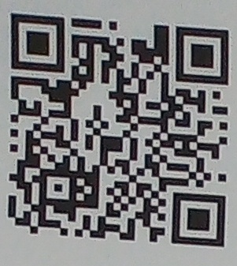

# Grain-QD-Detection
 
This project is a Python toolkit for reading, detecting, and processing QR codes and ChArUco boards in image files.

## Features
- Read QR codes from image files
- Detect and draw QR codes in images
- Batch processing of multiple images

   

   

   

   

## Installation

1. Clone this repository:
   git clone https://github.com/[YOUR_USERNAME]/[YOUR_REPOSITORY_NAME].git
   <!-- TODO: Update with the actual repository URL -->

2. Install dependencies:
   pip install -r requirements.txt

## Usage

Read QR Code from Image:
python read_qr.py path/to/image.png

Detect and Draw QR Code:
python detect_and_draw_qr.py path/to/input.png path/to/output.png

Batch Process QR Codes:
python batch_process_qrs.py path/to/input_folder path/to/output_folder

## Dependencies
Listed in requirements.txt:
- OpenCV
- NumPy
- pyzbar

## License
None
