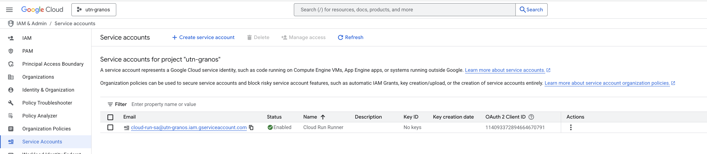
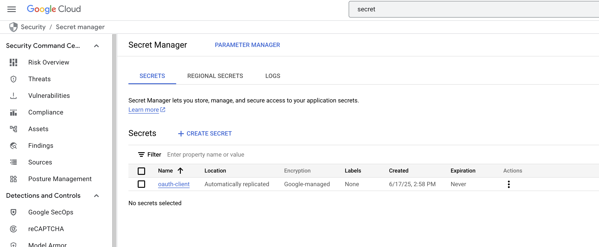

### View current project

% gcloud config get-value project

### Set project

% gcloud config set project utn-granos 

### Create a Service Account for the project 

gcloud iam service-accounts create cloud-run-sa \
  --display-name="Cloud Run Runner"

cloud-run-sa@utn-granos.iam.gserviceaccount.com *gets created*

### Give the service account full admin rights on all secrets in the project

% gcloud projects add-iam-policy-binding utn-granos \
  --member="serviceAccount:cloud-run-sa@utn-granos.iam.gserviceaccount.com" \
  --role="roles/secretmanager.admin"

### Enable the Secret Manager API (Project MUST HAVE a Billing account)

### Grant myself (or Your Service Account) Secret-Manager Permissions
gcloud services enable secretmanager.googleapis.com --project=utn-granos

### Create a new Secret Manager secret called oauth-client inside the active Google Cloud project and store client_secret.json there
 
% echo "$(<client_secret.json)" | \
  gcloud secrets create oauth-client --data-file=-

  

### List who has Secret Manager roles on the project

% gcloud projects get-iam-policy utn-granos \
  --flatten="bindings[].members" \
  --filter="bindings.role:secretmanager" \
  --format="table(bindings.role, bindings.members)"
