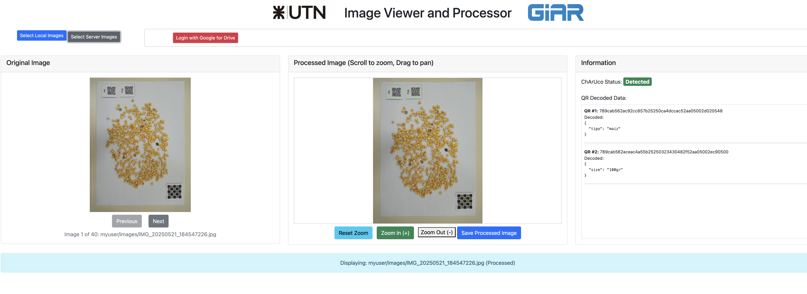

# Flask Image Processor for Grain-QD-Detection

This directory contains the core Flask web application for the Grain-QD-Detection project. It provides a web-based user interface for detecting ChArUco patterns and QR codes in images sourced from local uploads, a server-side directory, or Google Drive.



## Table of Contents

- [Flask Image Processor for Grain-QD-Detection](#flask-image-processor-for-grain-qd-detection)
  - [Table of Contents](#table-of-contents)
  - [Overview](#overview)
  - [Key Features](#key-features)
  - [Technical Stack](#technical-stack)
  - [Application Structure](#application-structure)
  - [Configuration](#configuration)
    - [Google OAuth 2.0 Credentials](#google-oauth-20-credentials)
    - [Environment Variables](#environment-variables)
  - [Local Development and Execution](#local-development-and-execution)
    - [Method 1: Using the Local Run Script (Recommended)](#method-1-using-the-local-run-script-recommended)
    - [Method 2: Using Docker Compose](#method-2-using-docker-compose)
  - [Google Cloud Deployment](#google-cloud-deployment)
    - [Prerequisites](#prerequisites)
    - [Deployment Script](#deployment-script)

## Overview

This Flask application serves as the backend and frontend for an image analysis tool. It is designed to be a standalone, containerized service that can be run locally or deployed to a cloud environment like Google Cloud Run.

The application's primary function is to process images to identify and analyze quality control markers. It provides a dynamic, single-page interface where users can load images, navigate through a series, and view processing results in real-time.

## Key Features

*   **Multiple Image Sources:**
    *   **Local Upload:** Upload one or more images directly from your computer.
    *   **Server-Side:** Process images from a pre-configured directory on the server (mounted as a Docker volume).
    *   **Google Drive:** Authenticate with a Google account to process images from a specified Drive folder.
*   **Advanced Image Analysis:**
    *   **QR Code Detection:** Identifies and decodes QR codes, with support for JSON-formatted content.
    *   **ChArUco Board Detection:** Detects ChArUco calibration patterns.
*   **Dynamic Web Interface:** A responsive UI built with vanilla JavaScript that communicates with the Flask backend via Fetch API calls, eliminating the need for page reloads.
*   **Secure Google Authentication:** Implements a full OAuth 2.0 flow to securely access Google Drive data, including token handling and refresh.
*   **State Management:** Uses the Flask session to maintain user state across requests, such as the current image list and navigation index.
*   **Containerized:** Fully containerized with Docker, ensuring consistent behavior across different environments.

## Technical Stack

*   **Backend Framework:** **Flask**
*   **WSGI Server:** **Gunicorn**
*   **Image Processing:** **OpenCV**, **Pillow**
*   **Containerization:** **Docker**
*   **Deployment Target:** **Google Cloud Run**

## Application Structure

```
.
├── app.py                  # Main Flask application logic, routes, and API endpoints
├── utils/                  # Image processing helper modules
│   ├── charuco_detector.py
│   └── detect_and_draw_qr.py
├── templates/              # Jinja2 HTML templates
│   └── index.html
├── static/                 # Frontend assets (CSS, JavaScript)
│   └── app.js
├── Dockerfile              # Defines the application's Docker image
├── tests/                  # Unit and integration tests
│   └── test_app.py
├── docker_build_and_run_locally.sh # Script for local execution
└── deploy_to_gcp.sh        # Script for deploying to Google Cloud
```

## Configuration

### Google OAuth 2.0 Credentials

To use the Google Drive integration, the application needs OAuth 2.0 client credentials.

1.  In the Google Cloud Console, navigate to **APIs & Services > Credentials**.
2.  Create an **OAuth client ID** for a **Web application**.
3.  Add the necessary **Authorized redirect URIs**:
    *   For local development: `http://mylocaldomain.com:8080/oauth2callback`
    *   For deployed app: `https://<your-cloud-run-url>/oauth2callback`
4.  Download the credentials JSON file.

### Environment Variables

The application is configured via environment variables. The most secure way to provide the Google credentials is by storing the content of the downloaded JSON file in a secret manager.

*   `GOOGLE_OAUTH_CREDENTIALS`: **(Required for Google Drive)** The full JSON content of your OAuth 2.0 credentials. For local development, this is fetched from GCP Secret Manager by the run script. For cloud deployment, this is injected by Cloud Run from Secret Manager.
*   `FLASK_SECRET_KEY`: A secret key used for signing session cookies. If not set, a default, insecure key is used.

## Local Development and Execution

### Method 1: Using the Local Run Script (Recommended)

This method builds the Docker image and runs a container, automatically fetching the Google OAuth credentials from Google Cloud Secret Manager.

**Prerequisites:**
*   Docker installed and running.
*   Google Cloud SDK (`gcloud`) installed and authenticated (`gcloud auth login`).
*   The OAuth credentials JSON content stored as a secret in GCP Secret Manager.
*   The `/etc/hosts` file on your machine must contain the line `127.0.0.1 mylocaldomain.com` for the Google redirect URI to work.

**Steps:**

1.  **Configure the Script:**
    Open `docker_build_and_run_locally.sh` and ensure the variables `PROJECT_ID`, `SECRET_NAME`, and `SECRET_VERSION` match your GCP setup.

2.  **Run the Script:**
    Make the script executable and run it from the `flask_app` directory.
    ```bash
    chmod +x ./docker_build_and_run_locally.sh
    ./docker_build_and_run_locally.sh
    ```

3.  **Access the Application:**
    Open your browser and navigate to `http://mylocaldomain.com:8080`.

### Method 2: Using Docker Compose

The project includes `docker-compose.yml` files for a more integrated local development setup, which also runs an FTP server for testing the "Server-Side Images" feature. This is ideal for active development.

```bash
# Build and start the services in the background
docker compose up -d --build

# Stop and remove the containers
docker compose down
```

When using Docker Compose, you will need to manage the `GOOGLE_OAUTH_CREDENTIALS` environment variable for the `flask-app` service yourself, for example by using an `.env` file.

## Google Cloud Deployment

The `deploy_to_gcp.sh` script automates deployment to Google Cloud Run. It builds the image, pushes it to Google Container Registry (GCR), and deploys it as a Cloud Run service with the necessary secret configuration.

### Prerequisites

*   A GCP project with the **Cloud Run** and **Secret Manager** APIs enabled.
*   The OAuth credentials JSON content stored as a secret in GCP Secret Manager.
*   Permissions to push to GCR and deploy to Cloud Run (e.g., `roles/storage.admin`, `roles/run.admin`).

### Deployment Script

1.  **Configure the Script:**
    Open `deploy_to_gcp.sh` and edit the variables at the top to match your environment:
    *   `PROJECT_ID`: Your Google Cloud Project ID.
    *   `IMAGE_NAME`: The desired name for your Docker image.
    *   `SERVICE_NAME`: The name for your Cloud Run service.
    *   `REGION`: The GCP region for deployment (e.g., `us-central1`).
    *   `SECRET_CONFIG`: The mapping from the environment variable to the GCP secret (e.g., `GOOGLE_OAUTH_CREDENTIALS=oauth-client:latest`).

2.  **Run the Script:**
    Make the script executable and run it.
    ```bash
    chmod +x ./deploy_to_gcp.sh
    ./deploy_to_gcp.sh
    ```

The script will output the URL of the deployed service upon completion. Remember to add this new URL to your **Authorized redirect URIs** in the Google Cloud Console for the OAuth client ID.
